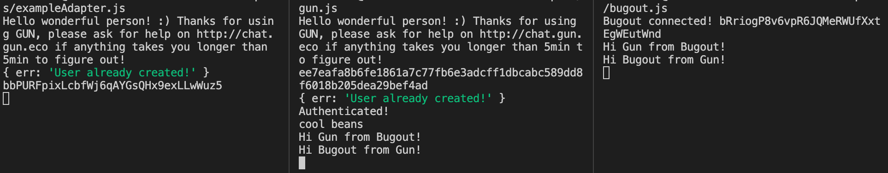

# Mishmesh
Transmit messages between peers regardless of underlying decentralization technology they are connected with

# Example
1. Run `> examples/exampleAdapter.js`
  - This is an example adapter that is built to relay messages between Gun and Bugout provided they share the same topic
2. Run `> examples/bugout.js`
3. Run `> examples/gun.js`
4. In the terminal for bugout, send a message and gun will receive it, and vice versa!